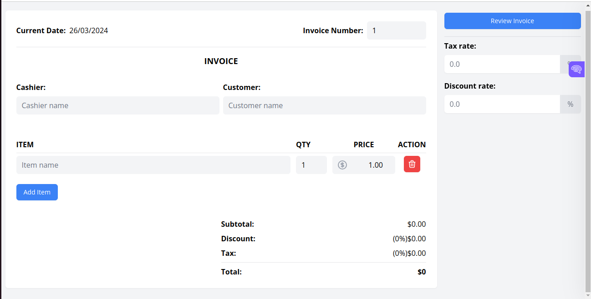

# Invoice Generator - ReactJs


An Invoice Generator project built with React and TailwindCSS. Add items, quantity, prices, tax rates and discounts.

### Live Demo

https://chihebbencheikh1.github.io/invoice-generator/

### Screenshots




### Tools

- React
- Tailwind CSS
- Headless UI
- Html-to-image
- jsPDF

### Instalation

```
git clone https://github.com/ChihebBENCHEIKH1/invoice-generator.git

npm install

npm start / npm run build
```

### Meta

Chiheb BEN CHEIKH
